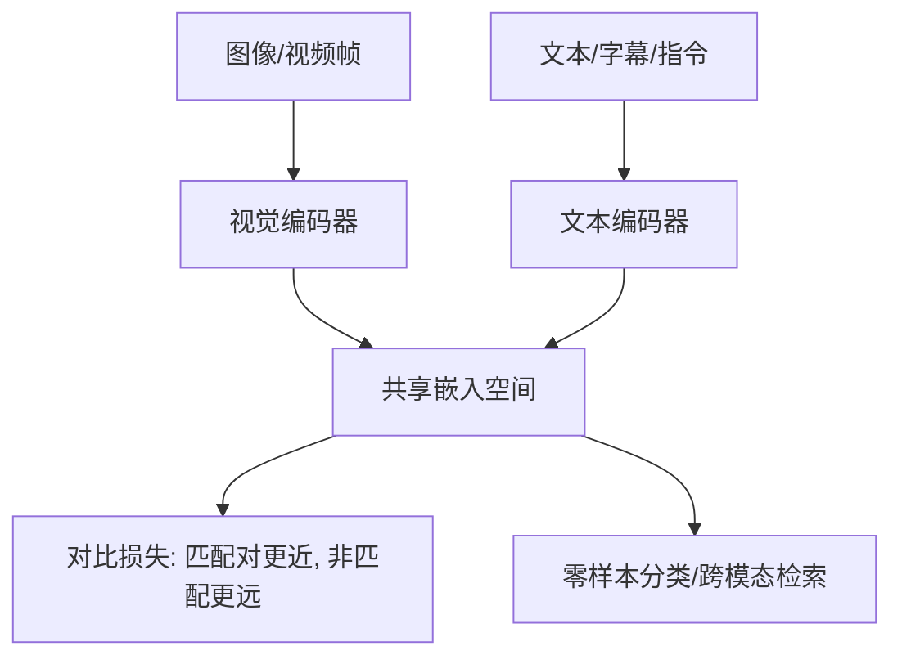

## Whisper

### 思想

Whisper 的核心思想可以概括为: 统一建模 + 大规模弱监督 + 多任务 token 控制.

* 统一建模: 采用标准 Transformer Encoder-Decoder. 先把语音转成 `log-Mel` 频谱, Encoder 编码声学信息, Decoder 通过自回归生成文本, 并用 cross-attention 对齐音频表示.
* 多任务一套模型: 不为每个任务单独训练模型, 而是通过特殊 token 控制任务行为, 比如 `transcribe`(转写), `translate`(翻译), 语言识别等, 本质是条件生成.
* 数据驱动优先于结构堆料: Whisper 的提升路径不是一味加参数, 而是靠更大规模的数据和更稳的训练策略提升泛化能力.

版本演进的主线:

* v1: 用大规模互联网弱监督语音文本对训练, 拿到强鲁棒性.
* v2: 在参数规模基本不变下, 通过更长训练 + 正则化提升准确率和稳定性: `SpecAugment`在 Mel 频谱上做时间/频率遮挡与时间扰动, 增强噪声与语速变化鲁棒性; `Stochastic Depth`训练时随机跳层, 降低过拟合并稳定深层训练; `BPE Dropout`在分词 merge 时随机跳过部分合并, 让同一句话形成不同子词切分, 提升泛化(注: 发生在训练阶段的文本侧分词, 训练标签文本(转写/翻译结果)要先做 BPE, 变成 token id 给 decoder 学习).
* v3: 进一步把训练数据量拉大, 并把 Mel bins 从 `80` 提到 `128`, 提升频域分辨率和多语言效果.

### 部署

```bash
uv pip install faster-whisper fastapi uvicorn python-multipart
```

`app.py` 示例: 

```python
from faster_whisper import WhisperModel
from fastapi import FastAPI, UploadFile, File
import tempfile

app = FastAPI()

model = WhisperModel(
    "tiny",
    device="cpu",
    compute_type="int8"
)

@app.post("/asr")
async def asr(file: UploadFile = File(...)):
    with tempfile.NamedTemporaryFile(delete=False, suffix=".wav") as f:
        f.write(await file.read())
        audio_path = f.name

    segments, info = model.transcribe(audio_path, vad_filter=True)
    text = "".join([seg.text for seg in segments])

    return {
        "language": info.language,
        "duration": info.duration,
        "text": text
    }
```

启动: 

```bash
uvicorn app:app --host 0.0.0.0 --port 8000
```

## 多模态融合方法

### 基于特征的拼接, 加权和门控的早期融合 

这一路线的核心是: 各模态先经各自编码器得到特征(或直接用原始特征), 在较低层做拼接(concat)/加权求和/门控(gating), 再交给后续网络或分类器. 

关键组件包括: **模态专用编码器(CNN/ViT, 声学模型, 文本编码器等)**, **归一化与尺度对齐(LayerNorm, feature scaling, 时间对齐/重采样)**, **融合算子: concat, 加权, 门控网络(由另一模态或任务上下文驱动权重)**. 

优势在于: 实现简单, 训练稳定, 易于并行, 易于处理"部分模态缺失"(可通过mask或门控退化). 局限在于: 跨模态交互被压缩为粗粒度组合, 难以捕捉"词—区域""音频—口型"等细粒度关系. 

### 基于跨模态注意力的中期融合与多模态Transformer.

该路线将"融合"显式建模为token级交互: 用**交叉注意力(cross-attention / co-attention)**在不同模态序列之间选择性聚合信息, 或将多模态token拼成一个序列用自注意力统一建模. 

代表性工作可以分为两类: **双流(two-stream):** 视觉与语言先分别编码, 再通过共注意力层交互(如 ViLBERT). **单流(single-stream)/联合编码**: 把视觉区域token与文本token拼接, 靠自注意力学习对齐与融合(如 UNITER, OSCAR 等). 

优势是能在细粒度(token/区域/帧)级别表达交互. 局限是是计算复杂度随token数平方增长, 图像/视频token化会显著放大成本; 

### 基于双线性/张量/高阶交互的显式融合

这一路线的动机是: 简单拼接本质上是线性可分的浅组合, 难以表达"哪个词与哪个视觉属性相互作用"的高阶关系; 而显式外积(bilinear / tensor) 具有更强表达力, 但计算不可承受, 因此发展出紧凑近似与低秩分解等实现. MCB提出用紧凑双线性近似外积以增强视觉-语言融合表达力; TFN将三模态交互显式展开为张量融合层以捕捉单/双/三模态动态. 

关键组件(常见组合)包括: 模态编码器(得到向量或序列表示); 高阶交互层: 紧凑双线性(如Tensor Sketch近似), 低秩张量分解, 或分组高阶融合; 下游任务头(VQA分类, 情感回归等). 

优势是: 对细粒度组合特征更敏感, 局限是: 参数与计算常显著增加, 对训练数据规模更敏感, 并且工程实现(高维张量, 数值稳定性, 分布式训练)难度高. 这也是后来很多系统转而用"注意力交互"作为更通用且可扩展的高阶交互近似. 

### 基于对比学习的跨模态对齐与共享嵌入空间

对比学习路线将多模态融合问题重心前移到"对齐": 先学习一个共享语义空间, 使得配对样本(如图像-文本)在嵌入空间相近, 非配对样本分离. 这一范式在大规模弱监督(网页图文对)下表现出极强的可扩展性, 并支撑了零样本迁移与检索能力. 典型双塔模型包括 CLIP 与 ALIGN, 均使用图像编码器与文本编码器分别编码, 再以对比损失进行对齐. 



优势是训练目标简单, 可扩展, 适合海量弱监督; 共享嵌入天然支持检索, 聚类, 零样本分类与跨域适配. 局限是纯双塔对"细粒度推理/计数/多步组合"通常不足, 需要再引入交叉注意力或生成式机制; 对数据偏见与噪声敏感, 且其偏见可能被规模放大并迁移到下游. 

### 跨模态预训练基础模型与多模态LLM的"接口式融合"


